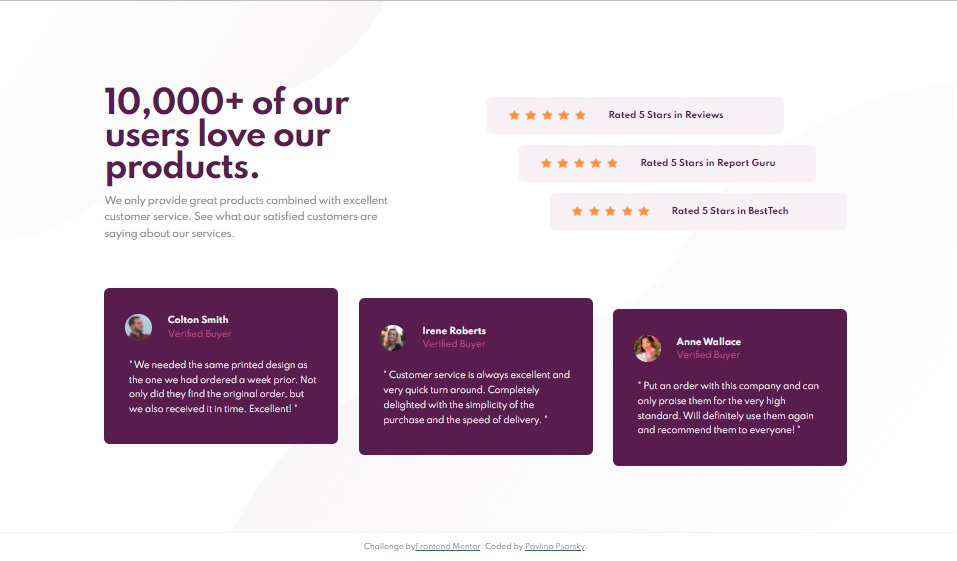
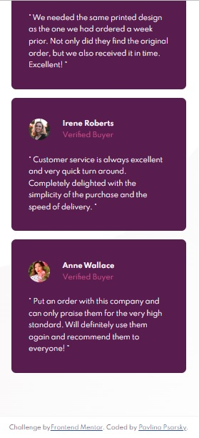
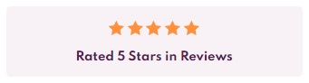

# Frontend Mentor - Social proof section solution

This is a solution to the [Social proof section challenge on Frontend Mentor](https://www.frontendmentor.io/challenges/social-proof-section-6e0qTv_bA). Frontend Mentor challenges help you improve your coding skills by building realistic projects. 

## Table of contents

- [Overview](#overview)
  - [The challenge](#the-challenge)
  - [Screenshot](#screenshot)
  - [Links](#links)
- [My process](#my-process)
  - [Built with](#built-with)
  - [What I learned](#what-i-learned)
  - [Continued development](#continued-development)
  - [Useful resources](#useful-resources)
- [Author](#author)
- [Acknowledgments](#acknowledgments)

## Overview

### The challenge

Users should be able to:

- View the optimal layout for the section depending on their device's screen size

### Screenshot

| Desktop layout |
|:--:|


| Mobile layout |
|:--:|
 

### Links

- Solution URL: https://github.com/PavlinaPs/social-proof-section
- Live Site URL: https://pavlinaps.github.io/social-proof-section/

## My process

### Built with

- Semantic HTML5 markup
- CSS custom properties
- Flexbox
- CSS Grid areas
- Mobile-first workflow

### What I learned

In this challenge, I felt most of the time that I know what I'm doing, the styles behaved as I thought they should. That's great!
Here are some remarks:

- #### BEM - Block Element Modifier 
I am pretending that this page is a part of a big website, with lots of styles in the css file. I tried to use BEM to name the classes. I suspect that not all are named properly according to BEM, but it is easy to know the way around the css file.

- #### Styling rating stars
I would rather style the rating stars as a repeating background image, because I would have saved a lot of code this way, but I didn't figure out how to set the space between them. I almost think it is not possible. I left the code in CSS, commented out.
```css
.section__ratings__stars {
    background-image: url(./images/icon-star.svg);
    background-position: center;
    background-repeat: space;
}
```
This is how it looked like (mobile layout):

And here is a nice article on this topic on CSS-TRICKS: [Five Methods for Five-Star Ratings](https://css-tricks.com/five-methods-for-five-star-ratings/) 

- #### The block shift
I did this the easiest possible way - at least I think it is - positioned rating and tesimonial blocks' parents to relative and added right or bottom position where needed.

### Continued development

I need to look up BEM again and use it correctly, I think it is the way how to stay organized in CSS. 
And also I need to work on setting the width and height.

### Useful resources

- Kevin Powell's YouTube tutorials, for example this one on CSS grid: [Learn CSS Grid the easy way](https://youtu.be/rg7Fvvl3taU)

## Author

- GitHub - [PavlinaPs](https://github.com/PavlinaPs)
- Frontend Mentor - [@PavlinaPs](https://www.frontendmentor.io/profile/PavlinaPs)

## Acknowledgments

It is great that I can solve Frontend Mentor's challenges. They are all very useful for me. As are Kevin Powells tutorials. Thank you!
